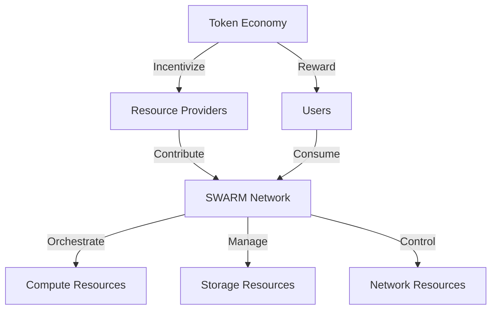

# Chapter 1: Executive Summary

## 1.1 Problem Statement

The cloud computing industry faces several critical challenges that disproportionately affect small to medium-sized businesses, developers, and emerging technology companies:

### 1.1.1 Cost Barriers
- Traditional cloud providers (AWS, GCP, Azure) have implemented pricing structures that create significant barriers to entry
- AI/ML workloads incur prohibitive costs, particularly for training and inference
- Storage and bandwidth costs scale non-linearly, punishing growth
- Hidden costs and complex pricing models make budgeting difficult

### 1.1.2 Technical Complexity
- Existing solutions require extensive DevOps expertise
- Complex configuration and management overhead
- Steep learning curve for advanced features
- Limited integration between services

### 1.1.3 Privacy Concerns
- Data sovereignty issues with centralized providers
- Limited control over data location and processing
- Inadequate privacy guarantees for sensitive workloads
- Compliance challenges for regulated industries

### 1.1.4 Resource Inefficiency
- Massive amounts of computing power worldwide sit idle
- Underutilized data center capacity
- Inefficient resource allocation
- Environmental impact of unused computing resources

## 1.2 Market Opportunity

### 1.2.1 Market Size and Growth
- Global cloud computing market: $483.98B (2024)
- Expected CAGR: 14.1% (2024-2030)
- AI/ML market segment growing at 37.3% CAGR
- Edge computing market expanding at 19.8% CAGR

### 1.2.2 Underserved Segments
- Small to medium-sized enterprises
- AI/ML startups and researchers
- Privacy-focused organizations
- Web3 and blockchain companies
- Educational institutions
- Independent developers

### 1.2.3 Resource Availability
- 60-70% of global compute capacity underutilized
- Growing number of edge data centers
- Increasing availability of specialized AI hardware
- Emergence of sustainable computing initiatives

## 1.3 Solution Overview

SWARM introduces a revolutionary approach to cloud infrastructure that addresses these challenges through:

### 1.3.1 Decentralized Architecture

### 1.3.2 Core Innovations
- AI-powered resource orchestration
- Privacy-first compute infrastructure
- Token-based economic model
- Automated scaling and optimization
- Simplified developer experience

### 1.3.3 Key Technologies
- Kubernetes-based orchestration
- Confidential computing enclaves
- Zero-knowledge proofs for privacy
- Smart contract-based resource allocation
- AI-optimized infrastructure

## 1.4 Value Proposition

### 1.4.1 Cost Benefits
- 65-80% cost reduction compared to traditional providers
- Predictable pricing model
- Pay-per-use billing
- No hidden fees or charges
- Resource optimization savings

### 1.4.2 Technical Advantages
- Simplified deployment process
- Integrated AI capabilities
- Advanced security features
- Automated resource management
- Comprehensive developer tools

### 1.4.3 Privacy Features
- Zero-knowledge computing options
- Data sovereignty controls
- Compliance-ready infrastructure
- Encrypted workloads
- Auditable processing

## 1.5 Key Differentiators

### 1.5.1 Cost Structure
| Service | SWARM | Traditional Cloud |
|---------|-----|------------------|
| Compute (per hour) | $0.015 | $0.052 |
| Storage (per GB) | $0.005 | $0.023 |
| Data Transfer (per GB) | $0.01 | $0.09 |
| AI Training (per hour) | $0.89 | $3.47 |

### 1.5.2 Feature Comparison
| Feature | SWARM | Traditional | Edge Providers |
|---------|-----|-------------|----------------|
| Privacy Computing | ✓ | ✗ | ✗ |
| Integrated AI | ✓ | Partial | ✗ |
| Token Economics | ✓ | ✗ | ✗ |
| Global Distribution | ✓ | ✓ | Partial |
| Developer Tools | ✓ | ✓ | Partial |

### 1.5.3 Unique Capabilities
- Hybrid AI-traditional workload optimization
- Privacy-preserving computation
- Token-based resource allocation
- Community-driven infrastructure
- Sustainable computing focus

## 1.6 Target Use Cases

### 1.6.1 AI/ML Development
- Model training and fine-tuning
- Inference deployment
- Dataset management
- Research environments

### 1.6.2 Web Applications
- Dynamic websites
- API backends
- Serverless applications
- Content delivery

### 1.6.3 Privacy-Sensitive Workloads
- Healthcare data processing
- Financial computations
- Personal data handling
- Regulatory compliance

### 1.6.4 Blockchain and Web3
- Node hosting
- Smart contract deployment
- DApp infrastructure
- Decentralized storage

## 1.7 Initial Impact Metrics

### 1.7.1 Performance Goals
- 99.99% uptime guarantee
- 100ms average latency
- 65% cost reduction vs. competitors
- 90% resource utilization efficiency

### 1.7.2 Environmental Impact
- 40% reduction in energy waste
- Carbon-neutral operations
- Sustainable resource usage
- Green computing initiatives

### 1.7.3 Market Goals
- 5% market share within 24 months
- 100,000 active developers
- 1M+ deployed applications
- Present in 50+ countries

This executive summary provides a comprehensive overview of SWARM's position in the market, its core value propositions, and its strategic objectives. The following chapters will delve into the technical specifications and implementation details of each component.