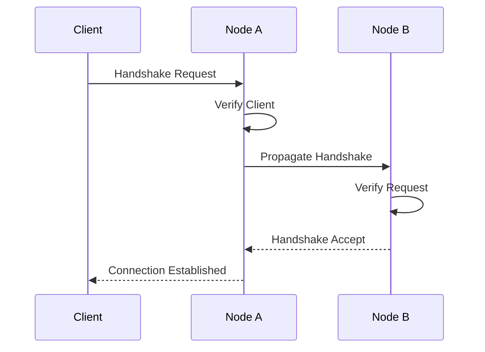

# Chapter 11: Network Protocol

## 11.1 Protocol Overview

The SWARM Network Protocol is designed to be lightweight, efficient, and resilient. It enables seamless communication between nodes, services, and clients while maintaining security and performance. Our protocol is built on proven standards while introducing innovative features for distributed cloud operations.

### 11.1.1 Core Principles

1. **Simplicity**
   - Minimal protocol overhead
   - Clear message formats
   - Straightforward implementation
   - Easy debugging

2. **Efficiency**
   - Optimized data transfer
   - Reduced latency
   - Bandwidth optimization
   - Resource-aware routing

3. **Reliability**
   - Automatic error recovery
   - Message delivery guarantees
   - Connection resilience
   - State synchronization

4. **Security**
   - End-to-end encryption
   - Zero-knowledge proofs
   - Tamper detection
   - Authentication at every level

## 11.2 Protocol Specification

### 11.2.1 Message Format

Basic message structure:

```typescript
interface SWARMMessage {
    header: {
        version: number;        // Protocol version
        messageId: string;      // Unique message identifier
        timestamp: number;      // Unix timestamp
        type: MessageType;      // Message type
        sender: NodeId;         // Sender identifier
        receiver: NodeId;       // Receiver identifier
        flags: MessageFlags;    // Protocol flags
    };
    body: {
        payload: Uint8Array;    // Message payload
        encoding: string;       // Payload encoding
        compression: string;    // Compression method
    };
    signature: Uint8Array;      // Message signature
}

enum MessageType {
    HANDSHAKE = 0x01,
    DATA = 0x02,
    CONTROL = 0x03,
    HEARTBEAT = 0x04,
    SYNC = 0x05
}

interface MessageFlags {
    encrypted: boolean;         // Message is encrypted
    compressed: boolean;        // Message is compressed
    priority: Priority;         // Message priority
    retryable: boolean;        // Can be retried
}
```

### 11.2.2 Connection Establishment

Handshake process:



Implementation:

```typescript
class ConnectionManager {
    async establishConnection(peer: PeerInfo): Promise<Connection> {
        // Generate connection parameters
        const params = await this.generateParams({
            encryption: 'aes-256-gcm',
            compression: 'zstd',
            protocol_version: CURRENT_VERSION
        });

        // Perform handshake
        const handshake = await this.performHandshake(peer, params);

        // Establish secure channel
        const channel = await this.establishSecureChannel(handshake);

        // Start keepalive
        this.startKeepalive(channel);

        return new Connection(channel);
    }
}
```

## 11.3 Data Transport

### 11.3.1 Transport Layer

```typescript
class TransportLayer {
    private connections: Map<NodeId, Connection>;
    private multiplexer: StreamMultiplexer;
    private flowControl: FlowController;

    async sendData(
        destination: NodeId,
        data: Uint8Array,
        options: SendOptions
    ): Promise<void> {
        // Get or establish connection
        const connection = await this.getConnection(destination);

        // Apply flow control
        await this.flowControl.acquireSlot(data.length);

        try {
            // Prepare data chunks
            const chunks = this.prepareChunks(data, options);

            // Send chunks with multiplexing
            await this.multiplexer.sendChunks(connection, chunks);

            // Wait for acknowledgment if required
            if (options.requireAck) {
                await this.waitForAck(chunks);
            }
        } finally {
            // Release flow control slot
            this.flowControl.releaseSlot(data.length);
        }
    }

    private prepareChunks(data: Uint8Array, options: SendOptions): DataChunk[] {
        return this.chunkifier.chunk(data, {
            maxSize: options.maxChunkSize || 1024 * 64,
            compression: options.compression || 'zstd',
            priority: options.priority || 'normal'
        });
    }
}
```

### 11.3.2 Flow Control

```typescript
class FlowController {
    private windowSize: number;
    private currentLoad: number;
    private queue: PriorityQueue<PendingTransfer>;

    async acquireSlot(size: number): Promise<void> {
        // Check current load
        if (this.currentLoad + size > this.windowSize) {
            // Queue the transfer request
            await this.queue.push({
                size,
                priority: this.calculatePriority(size)
            });

            // Wait for slot
            await this.waitForSlot(size);
        }

        // Update current load
        this.currentLoad += size;
    }

    private calculatePriority(size: number): number {
        // Implement fair queueing with size consideration
        return Math.max(1, Math.log2(size));
    }
}
```

## 11.4 Service Discovery

### 11.4.1 Node Discovery

```typescript
class NodeDiscovery {
    private peers: Map<NodeId, PeerInfo>;
    private dht: DistributedHashTable;

    async discoverPeers(): Promise<PeerInfo[]> {
        // Query DHT for active nodes
        const nodes = await this.dht.findNodes({
            region: this.config.region,
            service: this.config.service,
            capacity: true
        });

        // Filter and rank nodes
        const rankedNodes = this.rankNodes(nodes, {
            latency: true,
            capacity: true,
            reliability: true
        });

        // Update peer list
        await this.updatePeers(rankedNodes);

        return rankedNodes;
    }

    private rankNodes(nodes: NodeInfo[], criteria: RankingCriteria): PeerInfo[] {
        // Implement node ranking algorithm
        return nodes
            .map(node => ({
                node,
                score: this.calculateNodeScore(node, criteria)
            }))
            .sort((a, b) => b.score - a.score)
            .map(ranked => ranked.node);
    }
}
```

### 11.4.2 Service Registration

```typescript
class ServiceRegistry {
    private services: Map<string, ServiceInfo>;
    private healthChecker: HealthChecker;

    async registerService(service: ServiceInfo): Promise<void> {
        // Validate service information
        this.validateService(service);

        // Register with network
        await this.announceService(service);

        // Start health checking
        await this.healthChecker.startChecking(service, {
            interval: '30s',
            timeout: '5s',
            unhealthy_threshold: 3
        });

        // Set up automatic re-registration
        this.setupReregistration(service);
    }

    private setupReregistration(service: ServiceInfo): void {
        // Implement periodic re-registration
        setInterval(async () => {
            if (await this.healthChecker.isHealthy(service)) {
                await this.announceService(service);
            }
        }, REREGISTRATION_INTERVAL);
    }
}
```

## 11.5 State Synchronization

### 11.5.1 Consistency Protocol

```typescript
class StateManager {
    private state: NetworkState;
    private consensus: ConsensusProtocol;

    async updateState(update: StateUpdate): Promise<void> {
        // Prepare update
        const preparedUpdate = await this.prepareUpdate(update);

        // Achieve consensus
        const agreement = await this.consensus.propose(preparedUpdate);

        if (agreement.accepted) {
            // Apply update
            await this.applyUpdate(preparedUpdate);

            // Notify peers
            await this.notifyPeers(preparedUpdate);
        }
    }

    private async prepareUpdate(update: StateUpdate): Promise<PreparedUpdate> {
        return {
            timestamp: Date.now(),
            version: this.state.version + 1,
            changes: update.changes,
            hash: await this.calculateUpdateHash(update)
        };
    }
}
```

### 11.5.2 Conflict Resolution

```typescript
class ConflictResolver {
    async resolveConflict(
        localState: NetworkState,
        remoteState: NetworkState
    ): Promise<NetworkState> {
        // Compare state versions
        if (localState.version === remoteState.version) {
            return this.mergeConcurrentUpdates(localState, remoteState);
        }

        // Handle version difference
        if (localState.version < remoteState.version) {
            return this.fetchMissingUpdates(localState, remoteState);
        }

        // Local version is ahead
        return this.propagateUpdates(localState, remoteState);
    }

    private async mergeConcurrentUpdates(
        local: NetworkState,
        remote: NetworkState
    ): Promise<NetworkState> {
        // Implement CRDT-based merge
        return this.crdtMerge(local, remote);
    }
}
```

## 11.6 Protocol Security

### 11.6.1 Message Security

```typescript
class MessageSecurity {
    private crypto: CryptoProvider;
    private keyManager: KeyManager;

    async secureMessage(message: SWARMMessage): Promise<SecureMessage> {
        // Get encryption key
        const key = await this.keyManager.getKey(message.receiver);

        // Encrypt message
        const encrypted = await this.crypto.encrypt(
            message.body.payload,
            key,
            {
                associated_data: message.header
            }
        );

        // Sign message
        const signature = await this.crypto.sign(
            Buffer.concat([
                this.serializeHeader(message.header),
                encrypted
            ])
        );

        return {
            header: message.header,
            body: {
                payload: encrypted,
                encoding: 'encrypted',
                compression: message.body.compression
            },
            signature
        };
    }
}
```

### 11.6.2 Protocol Guards

```typescript
class ProtocolGuard {
    private rateLimiter: RateLimiter;
    private validator: MessageValidator;

    async validateMessage(message: SWARMMessage): Promise<boolean> {
        // Check rate limits
        if (!await this.rateLimiter.checkLimit(message.sender)) {
            throw new RateLimitExceeded();
        }

        // Validate message format
        if (!this.validator.validateFormat(message)) {
            throw new InvalidMessageFormat();
        }

        // Verify signature
        if (!await this.verifySignature(message)) {
            throw new InvalidSignature();
        }

        return true;
    }

    private async verifySignature(message: SWARMMessage): Promise<boolean> {
        // Implement signature verification
        return this.crypto.verify(
            message.signature,
            this.calculateMessageHash(message)
        );
    }
}
```

The SWARM Network Protocol provides a robust foundation for distributed cloud operations while maintaining simplicity and efficiency. This protocol enables secure, reliable communication between network participants while optimizing for performance and resource utilization.