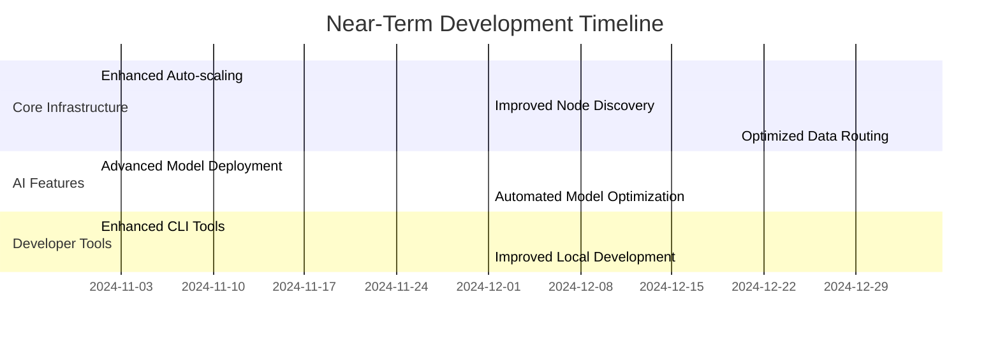

# Chapter 13: Future Developments

## 13.1 Vision and Direction

SWARM is committed to democratizing cloud infrastructure, making enterprise-grade capabilities accessible to developers and teams of all sizes. Our future development focuses on enhancing this core mission through innovation and continuous improvement.

### 13.1.1 Development Principles

1. **Accessibility First**
   - Further simplify complex operations
   - Reduce technical barriers
   - Improve self-service capabilities
   - Enhance documentation and learning resources

2. **Cost Optimization**
   - Continuous efficiency improvements
   - Smart resource allocation
   - Automated cost optimization
   - Transparent pricing models

3. **Developer Experience**
   - Streamlined workflows
   - Enhanced debugging tools
   - Improved integration options
   - Better development tools

4. **Community Focus**
   - Open source components
   - Community-driven features
   - Collaborative development
   - Shared knowledge base

## 13.2 Technical Roadmap

### 13.2.1 Near-Term Developments (6 Months)



### 13.2.2 Mid-Term Initiatives (12 Months)

1. **Enhanced Resource Optimization**
```typescript
interface ResourceOptimization {
    automatic_scaling: {
        predictive: boolean;
        ml_powered: boolean;
        cost_aware: boolean;
    };
    workload_placement: {
        locality_aware: boolean;
        cost_optimized: boolean;
        performance_based: boolean;
    };
    resource_sharing: {
        cross_node: boolean;
        intelligent_pooling: boolean;
        dynamic_allocation: boolean;
    };
}
```

2. **Advanced AI Infrastructure**
```typescript
interface AIEnhancements {
    model_deployment: {
        zero_downtime: boolean;
        automatic_scaling: boolean;
        cost_optimization: boolean;
    };
    training_infrastructure: {
        distributed_training: boolean;
        automatic_sharding: boolean;
        pipeline_parallelism: boolean;
    };
    inference_optimization: {
        dynamic_batching: boolean;
        hardware_acceleration: boolean;
        model_caching: boolean;
    };
}
```

3. **Developer Experience Improvements**
```typescript
interface DeveloperTools {
    local_development: {
        perfect_parity: boolean;
        instant_feedback: boolean;
        automated_testing: boolean;
    };
    deployment_tools: {
        zero_config: boolean;
        automatic_rollback: boolean;
        progressive_delivery: boolean;
    };
    monitoring_tools: {
        unified_dashboard: boolean;
        predictive_alerts: boolean;
        cost_analytics: boolean;
    };
}
```

## 13.3 Research Areas

### 13.3.1 Efficiency Research

Areas where we're focusing our research efforts:

```python
class EfficiencyResearch:
    def __init__(self):
        self.research_areas = {
            'resource_optimization': {
                'focus': 'Improving resource utilization',
                'target': '40% reduction in waste',
                'methods': [
                    'ML-based prediction',
                    'Dynamic resource sharing',
                    'Workload analysis'
                ]
            },
            'energy_efficiency': {
                'focus': 'Reducing energy consumption',
                'target': '30% reduction in power usage',
                'methods': [
                    'Workload scheduling',
                    'Hardware optimization',
                    'Cooling efficiency'
                ]
            },
            'cost_reduction': {
                'focus': 'Lowering operational costs',
                'target': '25% reduction in running costs',
                'methods': [
                    'Automated management',
                    'Smart resource allocation',
                    'Predictive maintenance'
                ]
            }
        }
```

### 13.3.2 Innovation Projects

Current innovation focus areas:

```typescript
interface InnovationProjects {
    distributed_computing: {
        project: "Edge-Core Harmony";
        goal: "Seamless edge-cloud integration";
        innovations: [
            "Automatic workload distribution",
            "Edge-aware scaling",
            "Locality-based optimization"
        ];
    };
    ai_infrastructure: {
        project: "AI Anywhere";
        goal: "Democratized AI deployment";
        innovations: [
            "Zero-config AI deployment",
            "Automatic model optimization",
            "Cost-effective training"
        ];
    };
    developer_experience: {
        project: "DevX Reinvented";
        goal: "Zero friction development";
        innovations: [
            "Instant environment creation",
            "Perfect local-cloud parity",
            "Automated optimization"
        ];
    };
}
```

## 13.4 Community Initiatives

### 13.4.1 Open Source Projects

Planned open source contributions:

```yaml
open_source_initiatives:
  - name: "SWARM Core Libraries"
    description: "Essential libraries for SWARM integration"
    components:
      - "Base SDK"
      - "CLI Tools"
      - "Development Utilities"
    timeline: "Q1 2025"

  - name: "SWARM Development Tools"
    description: "Tools for local development"
    components:
      - "Local Emulator"
      - "Testing Framework"
      - "Debug Tools"
    timeline: "Q2 2025"

  - name: "Resource Optimization Tools"
    description: "Tools for resource management"
    components:
      - "Cost Calculator"
      - "Resource Analyzer"
      - "Optimization Suggestions"
    timeline: "Q3 2025"
```

### 13.4.2 Developer Programs

```typescript
interface DeveloperPrograms {
    community_initiatives: {
        name: string;
        description: string;
        benefits: string[];
        timeline: string;
    }[];
}

const programs: DeveloperPrograms = {
    community_initiatives: [
        {
            name: "SWARM Pioneers",
            description: "Early adopter program",
            benefits: [
                "Early access to features",
                "Direct support channel",
                "Influence on roadmap"
            ],
            timeline: "Q1 2025"
        },
        {
            name: "Community Contributors",
            description: "Open source contribution program",
            benefits: [
                "Recognition and rewards",
                "Premium features access",
                "Community influence"
            ],
            timeline: "Q2 2025"
        },
        {
            name: "Developer Champions",
            description: "Community leadership program",
            benefits: [
                "Speaking opportunities",
                "Community leadership",
                "Advanced access"
            ],
            timeline: "Q3 2025"
        }
    ]
};
```

## 13.5 Scalability Plans

### 13.5.1 Network Growth

Plans for sustainable network expansion:

```typescript
interface NetworkGrowth {
    targets: {
        nodes: number;
        regions: number;
        capacity: string;
    };
    phases: {
        phase: string;
        timeline: string;
        objectives: string[];
    }[];
}

const growthPlan: NetworkGrowth = {
    targets: {
        nodes: 100000,
        regions: 50,
        capacity: "1000 petaFLOPS"
    },
    phases: [
        {
            phase: "Foundation",
            timeline: "Q1-Q2 2025",
            objectives: [
                "Core infrastructure expansion",
                "Regional presence establishment",
                "Network optimization"
            ]
        },
        {
            phase: "Acceleration",
            timeline: "Q3-Q4 2025",
            objectives: [
                "Rapid node onboarding",
                "Service expansion",
                "Performance optimization"
            ]
        },
        {
            phase: "Maturation",
            timeline: "2026",
            objectives: [
                "Full regional coverage",
                "Advanced service deployment",
                "Ecosystem development"
            ]
        }
    ]
};
```

### 13.5.2 Performance Targets

```typescript
interface PerformanceTargets {
    compute: {
        latency: string;
        throughput: string;
        availability: string;
    };
    storage: {
        iops: string;
        bandwidth: string;
        durability: string;
    };
    network: {
        bandwidth: string;
        latency: string;
        reliability: string;
    };
}

const targets: PerformanceTargets = {
    compute: {
        latency: "<50ms",
        throughput: "1M IOPS",
        availability: "99.99%"
    },
    storage: {
        iops: "100k IOPS",
        bandwidth: "10 GB/s",
        durability: "99.999999999%"
    },
    network: {
        bandwidth: "100 Gbps",
        latency: "<10ms",
        reliability: "99.99%"
    }
};
```

This future developments chapter outlines our commitment to making cloud infrastructure more accessible and affordable while maintaining high performance and reliability. Our focus remains on empowering developers and teams of all sizes with enterprise-grade capabilities at consumer-friendly prices.