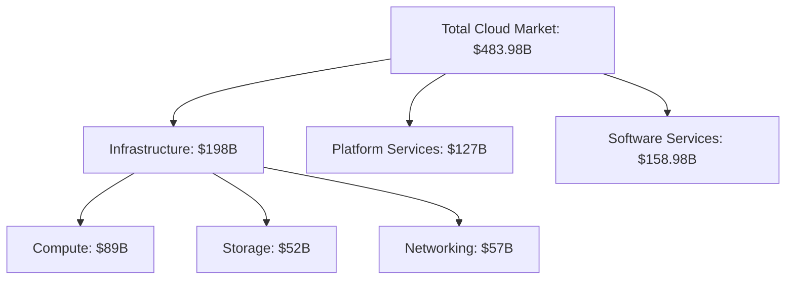
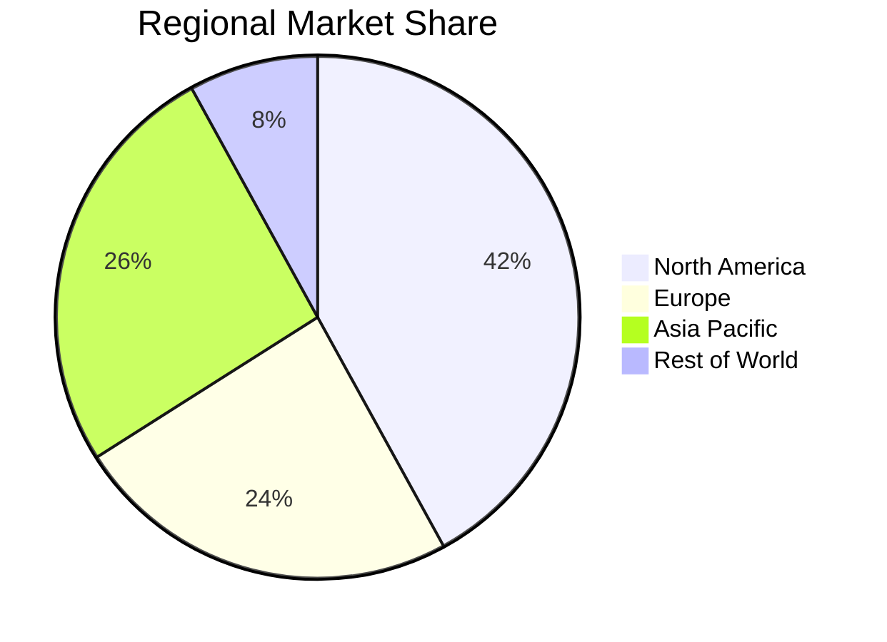
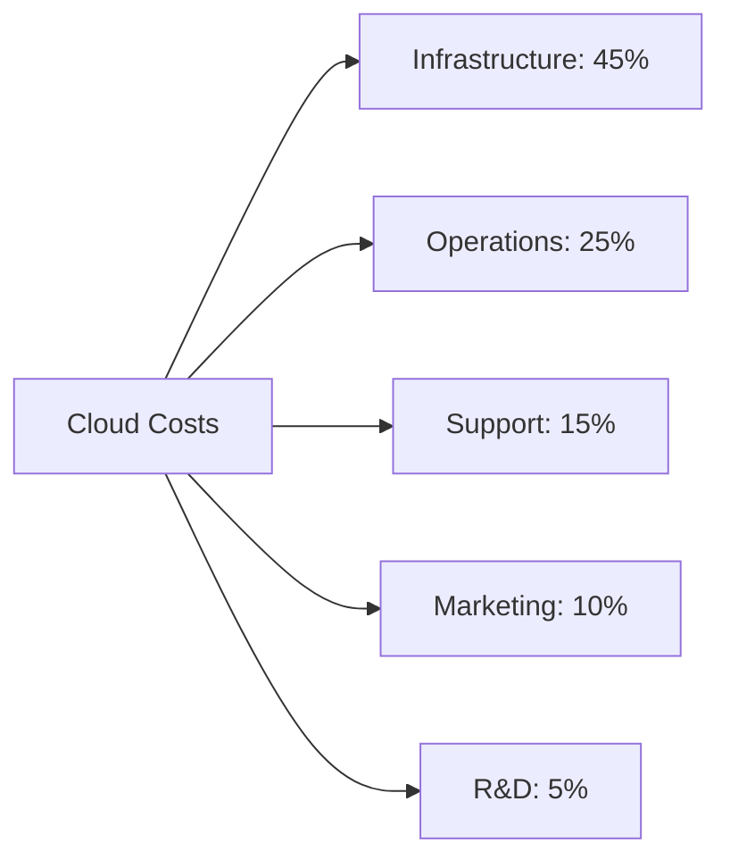
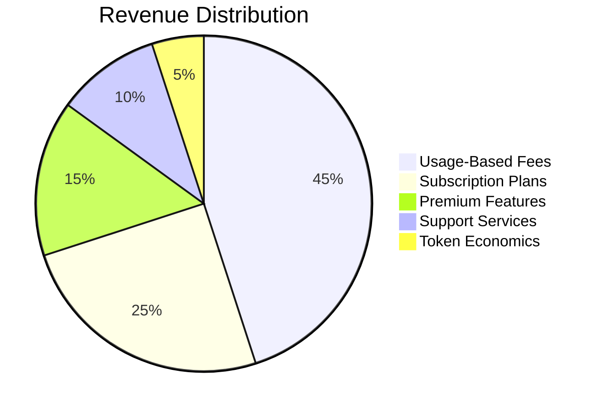
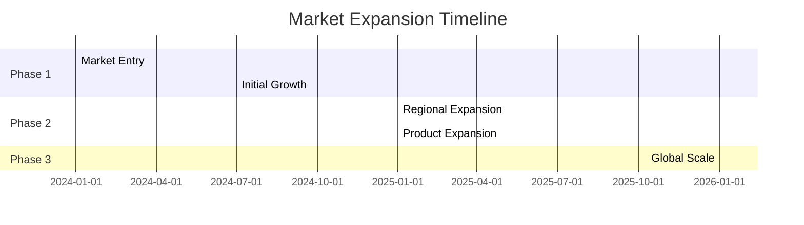

# Chapter 2: Business Case

## 2.1 Market Analysis

### 2.1.1 Global Cloud Computing Market
- Total Addressable Market (TAM): $483.98B (2024)
- Serviceable Addressable Market (SAM): $198B
- Serviceable Obtainable Market (SOM): $19.8B



### 2.1.2 Market Segment Growth Rates
| Segment | CAGR | 2024 Size | 2027 Projection |
|---------|------|-----------|-----------------|
| General Cloud | 14.1% | $483.98B | $719.23B |
| AI/ML Cloud | 37.3% | $28.5B | $73.4B |
| Edge Computing | 19.8% | $12.4B | $21.3B |
| Privacy Computing | 41.2% | $8.2B | $23.1B |

### 2.1.3 Regional Market Distribution


## 2.2 Cost Analysis

### 2.2.1 Traditional Cloud Cost Structure


### 2.2.2 SWARM Cost Advantages
| Component | Traditional Cloud | SWARM | Savings |
|-----------|------------------|-----|----------|
| Compute | $0.052/hour | $0.015/hour | 71.2% |
| Storage | $0.023/GB | $0.005/GB | 78.3% |
| Bandwidth | $0.09/GB | $0.01/GB | 88.9% |
| AI Training | $3.47/hour | $0.89/hour | 74.4% |

### 2.2.3 Cost Optimization Mechanisms
- Dynamic resource allocation
- Predictive scaling
- Workload optimization
- Energy efficiency
- Token incentives

## 2.3 Competitive Landscape

### 2.3.1 Major Competitors Analysis
| Feature | AWS | GCP | Azure | SWARM |
|---------|-----|-----|-------|-----|
| Global Presence | ✓✓✓ | ✓✓✓ | ✓✓✓ | ✓✓ |
| Price | ✓ | ✓ | ✓ | ✓✓✓ |
| Privacy Features | ✓ | ✓✓ | ✓ | ✓✓✓ |
| AI Integration | ✓✓ | ✓✓✓ | ✓✓ | ✓✓✓ |
| Ease of Use | ✓ | ✓✓ | ✓ | ✓✓✓ |
| Developer Tools | ✓✓✓ | ✓✓✓ | ✓✓✓ | ✓✓ |

### 2.3.2 Competitive Advantages
1. **Cost Leadership**
   - 65-80% lower costs
   - Transparent pricing
   - No hidden fees
   - Token-based incentives

2. **Technical Innovation**
   - Privacy-first architecture
   - AI-powered optimization
   - Simplified deployment
   - Automated management

3. **Market Position**
   - Focus on underserved segments
   - Privacy-centric approach
   - Community-driven development
   - Sustainable operations

## 2.4 Target Markets

### 2.4.1 Primary Market Segments
1. **Small-to-Medium Enterprises**
   - Market Size: $89B
   - Growth Rate: 16.3%
   - Key Needs:
     - Cost efficiency
     - Easy deployment
     - Reliable support
     - Scalability

2. **AI/ML Startups**
   - Market Size: $28.5B
   - Growth Rate: 37.3%
   - Key Needs:
     - GPU access
     - Model training
     - Cost control
     - Development tools

3. **Privacy-Focused Organizations**
   - Market Size: $8.2B
   - Growth Rate: 41.2%
   - Key Needs:
     - Data protection
     - Compliance
     - Auditability
     - Sovereignty

### 2.4.2 Secondary Markets
1. **Educational Institutions**
   - Research computing
   - Student projects
   - Training environments

2. **Web3 Companies**
   - Blockchain infrastructure
   - DApp hosting
   - Smart contract deployment

3. **Individual Developers**
   - Personal projects
   - Prototypes
   - Testing environments

## 2.5 Revenue Models

### 2.5.1 Primary Revenue Streams


### 2.5.2 Revenue Models Breakdown
1. **Usage-Based Revenue**
   - Pay-per-use compute
   - Storage consumption
   - Network bandwidth
   - AI workload processing

2. **Subscription Plans**
   ```javascript
   const subscriptionTiers = {
     basic: {
       compute: '4 vCPU',
       storage: '100GB',
       bandwidth: '1TB',
       price: '$49/month'
     },
     professional: {
       compute: '16 vCPU',
       storage: '500GB',
       bandwidth: '5TB',
       price: '$199/month'
     },
     enterprise: {
       compute: 'Custom',
       storage: 'Custom',
       bandwidth: 'Custom',
       price: 'Custom'
     }
   };
   ```

3. **Premium Features**
   - Advanced security
   - Priority support
   - Reserved capacity
   - Custom solutions

### 2.5.3 Token Economy Revenue
- Network participation rewards
- Staking returns
- Service fees
- Governance participation

## 2.6 Total Cost of Ownership (TCO) Analysis

### 2.6.1 Traditional Cloud TCO
```typescript
interface TraditionalTCO {
  direct_costs: {
    compute: number;
    storage: number;
    network: number;
    licenses: number;
  };
  indirect_costs: {
    operations: number;
    training: number;
    support: number;
    compliance: number;
  };
}

// Example Annual TCO for Mid-sized Application
const traditionalTCO: TraditionalTCO = {
  direct_costs: {
    compute: 120000,
    storage: 48000,
    network: 36000,
    licenses: 24000
  },
  indirect_costs: {
    operations: 180000,
    training: 40000,
    support: 60000,
    compliance: 30000
  }
  // Total: $538,000
};
```

### 2.6.2 SWARM TCO
```typescript
interface SWARMTCO {
  direct_costs: {
    compute: number;
    storage: number;
    network: number;
    tokens: number;
  };
  indirect_costs: {
    operations: number;
    training: number;
    support: number;
    compliance: number;
  };
}

// Example Annual TCO for Mid-sized Application
const swarmTCO: SWARMTCO = {
  direct_costs: {
    compute: 36000,
    storage: 12000,
    network: 4800,
    tokens: 12000
  },
  indirect_costs: {
    operations: 48000,
    training: 12000,
    support: 24000,
    compliance: 15000
  }
  // Total: $163,800
};
```

### 2.6.3 Comparative Analysis
| Cost Component | Traditional Cloud | SWARM | Savings |
|----------------|------------------|-----|----------|
| Direct Costs | $228,000 | $64,800 | 71.6% |
| Indirect Costs | $310,000 | $99,000 | 68.1% |
| Total TCO | $538,000 | $163,800 | 69.6% |

## 2.7 Growth Strategy

### 2.7.1 Market Penetration
- Aggressive pricing strategy
- Early adopter incentives
- Community building
- Strategic partnerships

### 2.7.2 Expansion Timeline


### 2.7.3 Key Performance Indicators
1. **Growth Metrics**
   - User acquisition rate
   - Resource utilization
   - Network expansion
   - Revenue growth

2. **Operational Metrics**
   - Service uptime
   - Response time
   - Customer satisfaction
   - Cost efficiency

3. **Financial Metrics**
   - Gross margin
   - Customer LTV
   - Acquisition costs
   - Token economics

This comprehensive business case demonstrates SWARM's strong market position, competitive advantages, and clear path to profitability through innovative technology and business models.