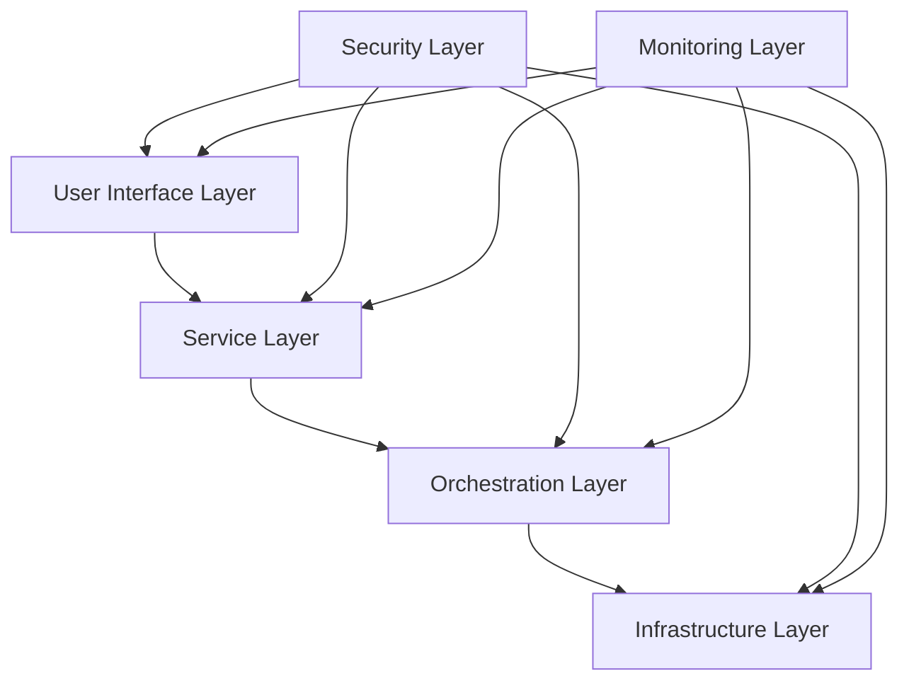
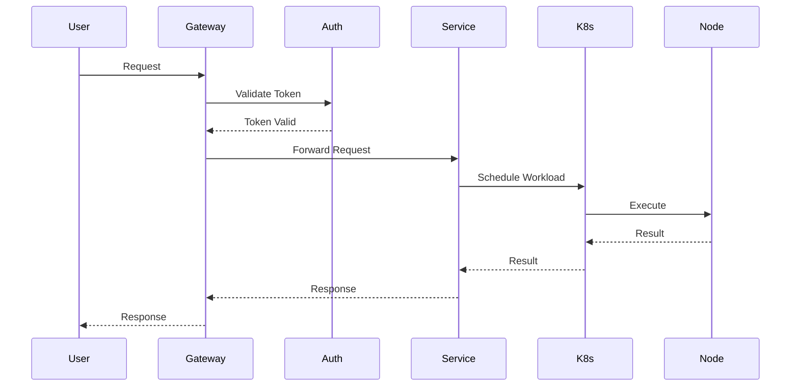

# Chapter 3: System Architecture

The SWARM system architecture is designed to provide a scalable, resilient, and secure cloud computing platform. This chapter details the technical implementation of each component, from the infrastructure layer to the service interfaces.

## 3.1 Architectural Overview

The SWARM platform is built on a multi-layered architecture that separates concerns while maintaining high cohesion between related components. Each layer is designed to be independently scalable and maintainable, while working in concert to deliver reliable cloud services.

The architecture follows several key principles:
- Separation of concerns through clear layer boundaries
- Scalability through horizontal expansion
- Resilience through redundancy and fault isolation
- Security through defense in depth
- Performance through distributed processing

### 3.1.1 System Layers

The SWARM platform is organized into distinct layers, each with specific responsibilities and interfaces. This layered approach allows for modular development, easier maintenance, and better isolation of concerns.

The primary layers are:

1. **User Interface Layer**
   - Provides web interfaces and API endpoints
   - Handles user authentication and session management
   - Implements rate limiting and request validation

2. **Service Layer**
   - Processes business logic and request handling
   - Manages service discovery and registration
   - Implements API versioning and backward compatibility

3. **Orchestration Layer**
   - Handles resource allocation and scheduling
   - Manages container orchestration through Kubernetes
   - Implements service mesh functionality

4. **Infrastructure Layer**
   - Manages physical and virtual resources
   - Handles storage and network operations
   - Provides basic monitoring and health checks

The system also includes two cross-cutting layers:

5. **Security Layer**
   - Implements authentication and authorization
   - Manages encryption and key distribution
   - Provides audit logging and compliance monitoring

6. **Monitoring Layer**
   - Collects metrics and performance data
   - Manages logging and tracing
   - Provides alerting and reporting capabilities


### 3.1.2 Core Components
```typescript
interface SystemComponents {
  infrastructure: {
    compute_nodes: ComputeNode[];
    storage_nodes: StorageNode[];
    network_nodes: NetworkNode[];
    gpu_nodes: GPUNode[];
  };
  orchestration: {
    kubernetes_clusters: K8sCluster[];
    service_mesh: ServiceMesh;
    load_balancers: LoadBalancer[];
  };
  services: {
    api_gateway: Gateway;
    authentication: AuthService;
    billing: BillingService;
    monitoring: MonitoringService;
  };
}
```

## 3.2 Infrastructure Layer

The Infrastructure Layer forms the foundation of the SWARM platform, providing the fundamental computing, storage, and networking resources required to run cloud services. This layer is designed to be highly scalable and flexible, accommodating various workload types while maintaining consistent performance and reliability.

Key features of the Infrastructure Layer include:
- Dynamic resource allocation based on demand
- Automatic scaling of compute and storage resources
- Built-in redundancy and failover capabilities
- Real-time monitoring and health checking
- Support for heterogeneous hardware configurations

### 3.2.1 Node Types and Specifications

The SWARM platform supports various node types, each optimized for specific workload characteristics. Node specifications are carefully chosen to balance performance, cost, and reliability. The platform automatically matches workloads with the most appropriate node type based on resource requirements and performance characteristics.

Each node type is defined with both minimum and recommended specifications to ensure consistent performance across the network. The specifications are regularly updated based on performance metrics and user requirements.

Key node types include:

1. **Compute Nodes**
   - General-purpose computing resources
   - Optimized for CPU-intensive workloads
   - Balanced memory and storage configurations

2. **GPU Nodes**
   - Specialized for AI/ML workloads
   - High-performance GPU configurations
   - Enhanced memory bandwidth

3. **Storage Nodes**
   - Optimized for data storage and retrieval
   - High I/O performance
   - Redundant storage configurations

```yaml
node_types:
  compute_node:
    minimum_specs:
      cpu: "4 cores"
      ram: "8 GB"
      storage: "100 GB SSD"
      network: "1 Gbps"
    recommended_specs:
      cpu: "16 cores"
      ram: "32 GB"
      storage: "1 TB NVMe"
      network: "10 Gbps"
  
  gpu_node:
    minimum_specs:
      gpu: "NVIDIA T4"
      vram: "16 GB"
      cpu: "8 cores"
      ram: "32 GB"
    recommended_specs:
      gpu: "NVIDIA A100"
      vram: "80 GB"
      cpu: "32 cores"
      ram: "128 GB"

  storage_node:
    minimum_specs:
      storage: "1 TB"
      iops: "5000"
      bandwidth: "500 MB/s"
    recommended_specs:
      storage: "10 TB"
      iops: "50000"
      bandwidth: "5 GB/s"
```

### 3.2.2 Resource Management

```golang
// Resource Allocation Manager
type ResourceManager struct {
    NodePool        map[string]*Node
    Allocations     map[string]*Allocation
    LoadBalancer    *LoadBalancer
    MetricsCollector *Metrics
}

func (rm *ResourceManager) AllocateResources(request ResourceRequest) (*Allocation, error) {
    // AI-powered resource allocation
    optimal := rm.findOptimalAllocation(request)
    
    // Check resource availability
    if !rm.hasCapacity(optimal) {
        return nil, ErrInsufficientResources
    }
    
    // Allocate resources
    alloc := rm.createAllocation(optimal)
    
    // Update metrics
    rm.MetricsCollector.RecordAllocation(alloc)
    
    return alloc, nil
}
```

## 3.3 Orchestration Layer

### 3.3.1 Kubernetes Implementation

```yaml
# Custom Resource Definition for SWARM Workloads
apiVersion: apiextensions.k8s.io/v1
kind: CustomResourceDefinition
metadata:
  name: swarm-workloads.swarm.network
spec:
  group: swarm.network
  versions:
    - name: v1
      served: true
      storage: true
      schema:
        openAPIV3Schema:
          type: object
          properties:
            spec:
              type: object
              properties:
                workloadType:
                  type: string
                  enum: [AI, General, HighMemory, GPU]
                resources:
                  type: object
                  properties:
                    cpu:
                      type: string
                    memory:
                      type: string
                    gpu:
                      type: string
                privacy:
                  type: object
                  properties:
                    confidentialComputing:
                      type: boolean
                    encryption:
                      type: string
```

### 3.3.2 Service Mesh Configuration

```yaml
# Istio Configuration for SWARM Service Mesh
apiVersion: networking.istio.io/v1alpha3
kind: VirtualService
metadata:
  name: swarm-services
spec:
  hosts:
    - "*.swarm.network"
  gateways:
    - swarm-gateway
  http:
    - match:
        - uri:
            prefix: "/api/v1"
      route:
        - destination:
            host: api-service
            subset: v1
            port:
              number: 80
          weight: 100
      corsPolicy:
        allowOrigins:
          - regex: ".*\\.swarm\\.network"
        allowMethods:
          - GET
          - POST
          - PUT
          - DELETE
        allowHeaders:
          - authorization
          - content-type
```

## 3.4 Service Layer

### 3.4.1 API Gateway Architecture

```typescript
// API Gateway Implementation
class SWARMApiGateway {
    private routes: Map<string, ServiceEndpoint>;
    private rateLimit: RateLimiter;
    private auth: AuthenticationService;
    
    async handleRequest(req: Request): Promise<Response> {
        // Validate token
        const token = await this.auth.validateToken(req.headers.authorization);
        
        // Rate limiting check
        if (!this.rateLimit.allowRequest(token.userId)) {
            throw new RateLimitExceededError();
        }
        
        // Route to appropriate service
        const service = this.routes.get(req.path);
        if (!service) {
            throw new ServiceNotFoundError();
        }
        
        // Execute request with circuit breaker
        return await this.executeWithCircuitBreaker(() => 
            service.handleRequest(req)
        );
    }
}
```

### 3.4.2 Service Registration

```golang
// Service Discovery and Registration
type ServiceRegistry struct {
    services map[string]*ServiceInfo
    mutex    sync.RWMutex
}

type ServiceInfo struct {
    ID          string
    Name        string
    Version     string
    Endpoints   []string
    Health      HealthStatus
    Metrics     ServiceMetrics
}

func (sr *ServiceRegistry) RegisterService(service *ServiceInfo) error {
    sr.mutex.Lock()
    defer sr.mutex.Unlock()
    
    // Validate service information
    if err := validateService(service); err != nil {
        return err
    }
    
    // Register service
    sr.services[service.ID] = service
    
    // Start health monitoring
    go sr.monitorHealth(service)
    
    return nil
}
```

## 3.5 Data Flow Architecture

### 3.5.1 Request Flow



### 3.5.2 Data Processing Pipeline

```python
class DataPipeline:
    def __init__(self):
        self.stages = []
        self.monitors = []
        
    async def process_data(self, data: bytes) -> ProcessedData:
        # Initialize pipeline
        pipeline_context = PipelineContext(data)
        
        # Execute stages
        for stage in self.stages:
            try:
                await stage.process(pipeline_context)
                await self.monitor_stage(stage, pipeline_context)
            except Exception as e:
                await self.handle_error(stage, e)
                
        return pipeline_context.result
```

## 3.6 High Availability Design

### 3.6.1 Redundancy Configuration

```yaml
# High Availability Configuration
ha_config:
  regions:
    - name: us-east
      zones:
        - us-east-1a
        - us-east-1b
        - us-east-1c
      min_nodes_per_zone: 3
      
  load_balancing:
    algorithm: "weighted_round_robin"
    health_check:
      interval: "10s"
      timeout: "5s"
      healthy_threshold: 2
      unhealthy_threshold: 3
      
  failover:
    automatic: true
    threshold_percent: 80
    backup_region: "us-west"
```

### 3.6.2 Disaster Recovery

```golang
// Disaster Recovery Manager
type DRManager struct {
    primaryRegion   *Region
    backupRegions   []*Region
    replicationMgr  *ReplicationManager
    failoverPolicy  FailoverPolicy
}

func (dr *DRManager) HandleFailover(event FailureEvent) error {
    // Detect failure type
    failureType := dr.classifyFailure(event)
    
    // Apply failover policy
    if dr.failoverPolicy.ShouldFailover(failureType) {
        // Initiate failover
        return dr.initiateFailover(dr.selectBackupRegion())
    }
    
    // Attempt recovery in primary region
    return dr.attemptRecovery(event)
}
```

## 3.7 Performance Optimization

### 3.7.1 Caching Strategy

```typescript
interface CacheConfig {
    type: 'memory' | 'redis' | 'distributed';
    maxSize: number;
    ttl: number;
    evictionPolicy: 'lru' | 'lfu' | 'fifo';
}

class CacheManager {
    private caches: Map<string, Cache>;
    private config: CacheConfig;
    
    async get(key: string): Promise<any> {
        const cache = this.selectCache(key);
        const value = await cache.get(key);
        
        if (!value) {
            const newValue = await this.fetchAndCache(key);
            await this.updateCacheStats(key);
            return newValue;
        }
        
        return value;
    }
}
```

### 3.7.2 Load Balancing

```python
class LoadBalancer:
    def __init__(self):
        self.nodes = []
        self.health_checks = HealthChecker()
        self.algorithms = {
            'round_robin': self.round_robin,
            'least_connections': self.least_connections,
            'weighted': self.weighted
        }
    
    async def route_request(self, request: Request) -> Node:
        # Get available nodes
        healthy_nodes = await self.health_checks.get_healthy_nodes()
        
        # Apply routing algorithm
        selected_node = await self.algorithms[self.current_algorithm](
            healthy_nodes,
            request
        )
        
        # Update metrics
        await self.update_metrics(selected_node)
        
        return selected_node
```

This chapter provides a comprehensive overview of SWARM's technical architecture, including detailed implementations and configurations for all major components. Each section includes practical code examples and diagrams to illustrate the design decisions and implementation details.