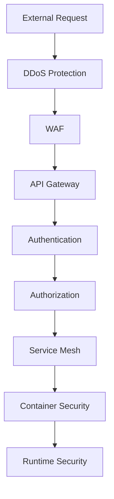
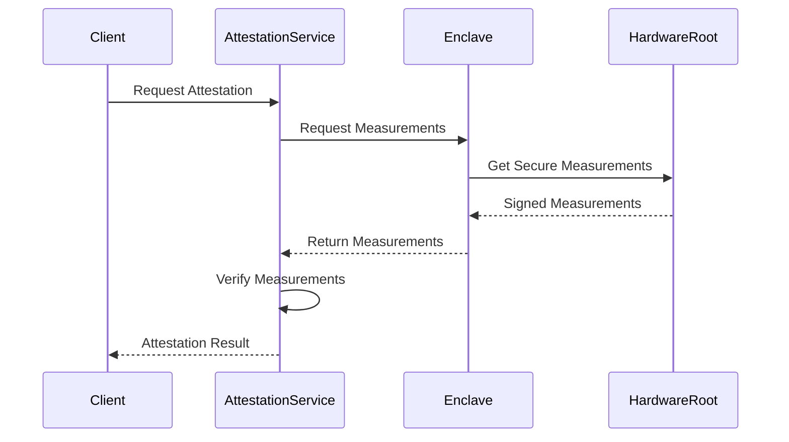

# Chapter 4: Privacy and Security

## 4.1 Security Architecture Overview

SWARM implements a comprehensive security architecture based on the principle of zero trust and defense in depth. Every component, from infrastructure to application layer, is designed with security as a fundamental requirement rather than an add-on feature.

### 4.1.1 Core Security Principles

1. **Zero Trust Architecture**
   - No implicit trust based on network location
   - All access requires authentication and authorization
   - Continuous validation of security posture
   - Microsegmentation of network resources

2. **Defense in Depth**
   - Multiple layers of security controls
   - Independent security mechanisms
   - Redundant security measures
   - Fail-secure defaults

The following diagram illustrates the layered security approach:



## 4.2 Confidential Computing Implementation

Confidential Computing ensures that data remains encrypted and protected even during processing. SWARM implements this through hardware-based trusted execution environments (TEEs).

### 4.2.1 Secure Enclave Architecture

```golang
// Secure Enclave Manager
type EnclaveManager struct {
    enclaves map[string]*Enclave
    attestationService *AttestationService
    keyManager *KeyManager
}

type Enclave struct {
    ID string
    Type EnclaveType // SGX, AMD-SEV, etc.
    SecurityLevel int
    Measurements []byte
    State EnclaveState
}

func (em *EnclaveManager) CreateEnclave(config EnclaveConfig) (*Enclave, error) {
    // Verify hardware capabilities
    if err := em.verifyHardwareSupport(config.Type); err != nil {
        return nil, fmt.Errorf("hardware not supported: %w", err)
    }

    // Initialize enclave
    enclave := &Enclave{
        ID: generateUUID(),
        Type: config.Type,
        SecurityLevel: config.SecurityLevel,
        State: EnclaveStatePending,
    }

    // Generate measurements
    measurements, err := em.generateMeasurements(enclave)
    if err != nil {
        return nil, fmt.Errorf("measurement generation failed: %w", err)
    }
    enclave.Measurements = measurements

    // Remote attestation
    if err := em.attestationService.Attest(enclave); err != nil {
        return nil, fmt.Errorf("attestation failed: %w", err)
    }

    enclave.State = EnclaveStateReady
    em.enclaves[enclave.ID] = enclave

    return enclave, nil
}
```

### 4.2.2 Remote Attestation Protocol

Remote attestation ensures the integrity and authenticity of secure enclaves. The protocol involves multiple steps to verify the security state of the computing environment.



## 4.3 Data Privacy Framework

### 4.3.1 Data Classification

SWARM implements a comprehensive data classification system to ensure appropriate handling of different types of information:

```typescript
interface DataClassification {
    level: 'public' | 'internal' | 'confidential' | 'restricted';
    encryption: EncryptionRequirements;
    retention: RetentionPolicy;
    access: AccessControls;
    compliance: ComplianceRequirements[];
}

class DataClassifier {
    private rules: ClassificationRule[];

    async classifyData(data: Buffer): Promise<DataClassification> {
        // Apply machine learning models for content analysis
        const contentType = await this.analyzeContent(data);
        
        // Apply classification rules
        const classification = this.applyRules(contentType, data);
        
        // Validate against compliance requirements
        await this.validateCompliance(classification);
        
        return classification;
    }
}
```

### 4.3.2 Data Protection Mechanisms

SWARM employs multiple layers of data protection:

1. **Encryption at Rest**
```typescript
interface EncryptionConfig {
    algorithm: 'AES-256-GCM' | 'ChaCha20-Poly1305';
    keyRotationPeriod: Duration;
    keyDerivation: {
        algorithm: 'PBKDF2' | 'Argon2id';
        parameters: KeyDerivationParams;
    };
}

class DataEncryption {
    private keyManager: KeyManager;
    private config: EncryptionConfig;

    async encrypt(data: Buffer, context: EncryptionContext): Promise<EncryptedData> {
        // Get encryption key
        const key = await this.keyManager.getKey(context);
        
        // Generate nonce
        const nonce = crypto.randomBytes(12);
        
        // Encrypt data
        const cipher = crypto.createCipheriv(this.config.algorithm, key, nonce);
        const encrypted = Buffer.concat([cipher.update(data), cipher.final()]);
        
        // Generate tag
        const tag = cipher.getAuthTag();
        
        return {
            encrypted,
            nonce,
            tag,
            keyId: key.id,
            algorithm: this.config.algorithm
        };
    }
}
```

2. **Encryption in Transit**
```typescript
interface TransitEncryption {
    tls: {
        version: 'TLS1.3';
        cipherSuites: string[];
        certificateRotation: Duration;
    };
    wireguard?: {
        enabled: boolean;
        keepalive: Duration;
    };
}
```

3. **Encryption in Use**
```typescript
class ConfidentialCompute {
    private enclave: Enclave;

    async processData(data: EncryptedData): Promise<ProcessedResult> {
        // Load data into secure enclave
        const dataHandle = await this.enclave.loadData(data);
        
        // Process within enclave
        const result = await this.enclave.process(dataHandle);
        
        // Seal result
        return await this.enclave.sealResult(result);
    }
}
```

## 4.4 Access Control System

### 4.4.1 Identity Management

```typescript
interface IdentityProvider {
    type: 'internal' | 'oauth' | 'saml' | 'oidc';
    config: {
        issuer: string;
        algorithms: string[];
        keyRotation: Duration;
    };
    mfa: {
        required: boolean;
        methods: ('totp' | 'webauthn' | 'sms')[];
    };
}

class IdentityManager {
    private providers: Map<string, IdentityProvider>;
    private sessionManager: SessionManager;

    async authenticate(credentials: AuthCredentials): Promise<Session> {
        // Validate credentials
        const identity = await this.validateCredentials(credentials);
        
        // Check MFA requirements
        if (this.requiresMFA(identity)) {
            await this.validateMFA(identity, credentials.mfa);
        }
        
        // Generate session
        return this.sessionManager.createSession(identity);
    }
}
```

### 4.4.2 Authorization Framework

SWARM implements a flexible, attribute-based access control (ABAC) system:

```typescript
interface AccessPolicy {
    effect: 'allow' | 'deny';
    principals: Principal[];
    actions: string[];
    resources: string[];
    conditions: Condition[];
}

class AuthorizationManager {
    private policies: AccessPolicy[];
    private evaluator: PolicyEvaluator;

    async checkAccess(principal: Principal, action: string, resource: string, context: RequestContext): Promise<Decision> {
        // Collect applicable policies
        const policies = this.findApplicablePolicies(principal, action, resource);
        
        // Evaluate policies
        const decisions = await Promise.all(
            policies.map(policy => this.evaluator.evaluate(policy, context))
        );
        
        // Combine decisions
        return this.combineDecisions(decisions);
    }
}
```

## 4.5 Security Monitoring and Response

### 4.5.1 Threat Detection

SWARM employs advanced threat detection mechanisms:

```typescript
interface ThreatDetection {
    rules: DetectionRule[];
    ml: {
        models: MLModel[];
        updateFrequency: Duration;
    };
    anomalyDetection: {
        baseline: BaselineConfig;
        sensitivity: number;
    };
}

class ThreatDetector {
    private rules: DetectionRule[];
    private mlEngine: MLEngine;
    private anomalyDetector: AnomalyDetector;

    async analyzeEvent(event: SecurityEvent): Promise<ThreatAssessment> {
        // Rule-based detection
        const ruleMatches = await this.checkRules(event);
        
        // ML-based detection
        const mlPrediction = await this.mlEngine.predict(event);
        
        // Anomaly detection
        const anomalyScore = await this.anomalyDetector.score(event);
        
        // Combine results
        return this.assessThreat(ruleMatches, mlPrediction, anomalyScore);
    }
}
```

### 4.5.2 Incident Response

The platform includes automated incident response capabilities:

```typescript
interface IncidentResponse {
    severity: 'low' | 'medium' | 'high' | 'critical';
    actions: ResponseAction[];
    notifications: NotificationConfig[];
    automation: AutomationRule[];
}

class IncidentResponder {
    private automationEngine: AutomationEngine;
    private notificationService: NotificationService;

    async handleIncident(incident: SecurityIncident): Promise<ResponseResult> {
        // Assess severity
        const severity = await this.assessSeverity(incident);
        
        // Execute automated responses
        const actions = await this.automationEngine.executeActions(
            incident,
            severity
        );
        
        // Send notifications
        await this.notificationService.notify(incident, actions);
        
        // Document response
        return this.documentResponse(incident, actions);
    }
}
```

## 4.6 Compliance Framework

### 4.6.1 Compliance Controls

The platform implements controls for various compliance standards:

```typescript
interface ComplianceControl {
    standard: string;
    requirement: string;
    implementation: ControlImplementation;
    monitoring: MonitoringConfig;
    reporting: ReportingConfig;
}

class ComplianceManager {
    private controls: Map<string, ComplianceControl>;
    private monitor: ComplianceMonitor;
    private reporter: ComplianceReporter;

    async assessCompliance(standard: string): Promise<ComplianceReport> {
        // Get relevant controls
        const controls = this.getControls(standard);
        
        // Assess each control
        const assessments = await Promise.all(
            controls.map(control => this.assessControl(control))
        );
        
        // Generate report
        return this.reporter.generateReport(standard, assessments);
    }
}
```

### 4.6.2 Audit Logging

Comprehensive audit logging is implemented across all components:

```typescript
interface AuditLog {
    timestamp: Date;
    actor: Principal;
    action: string;
    resource: string;
    result: 'success' | 'failure';
    context: AuditContext;
}

class AuditLogger {
    private storage: AuditStorage;
    private encoder: AuditEncoder;

    async logEvent(event: AuditableEvent): Promise<void> {
        // Encode event
        const encodedEvent = this.encoder.encode(event);
        
        // Sign event
        const signedEvent = await this.signEvent(encodedEvent);
        
        // Store event
        await this.storage.store(signedEvent);
    }
}
```

Each component of the security architecture is designed to work together seamlessly while maintaining independence, ensuring that a compromise in one area doesn't affect the entire system. The implementation follows industry best practices and is regularly updated to address new security challenges and requirements.